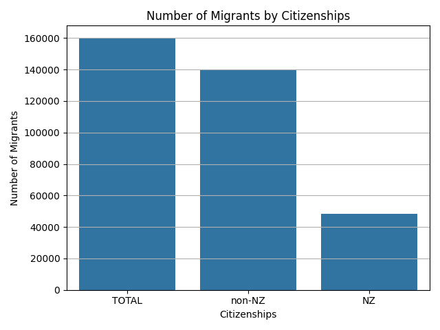
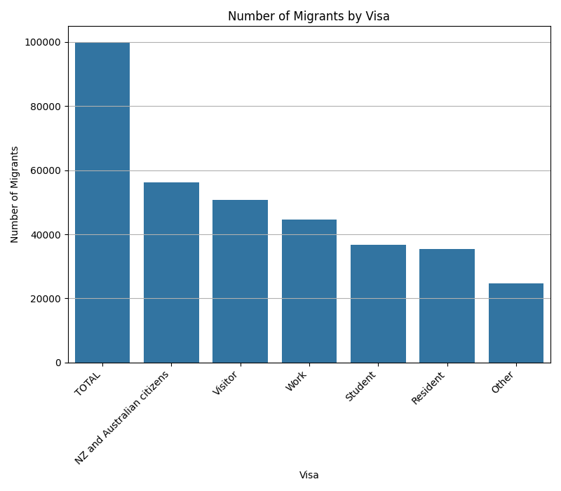
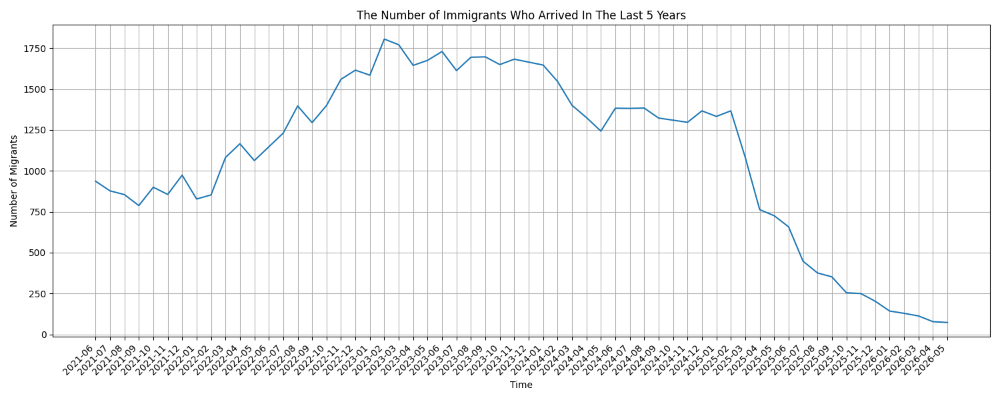
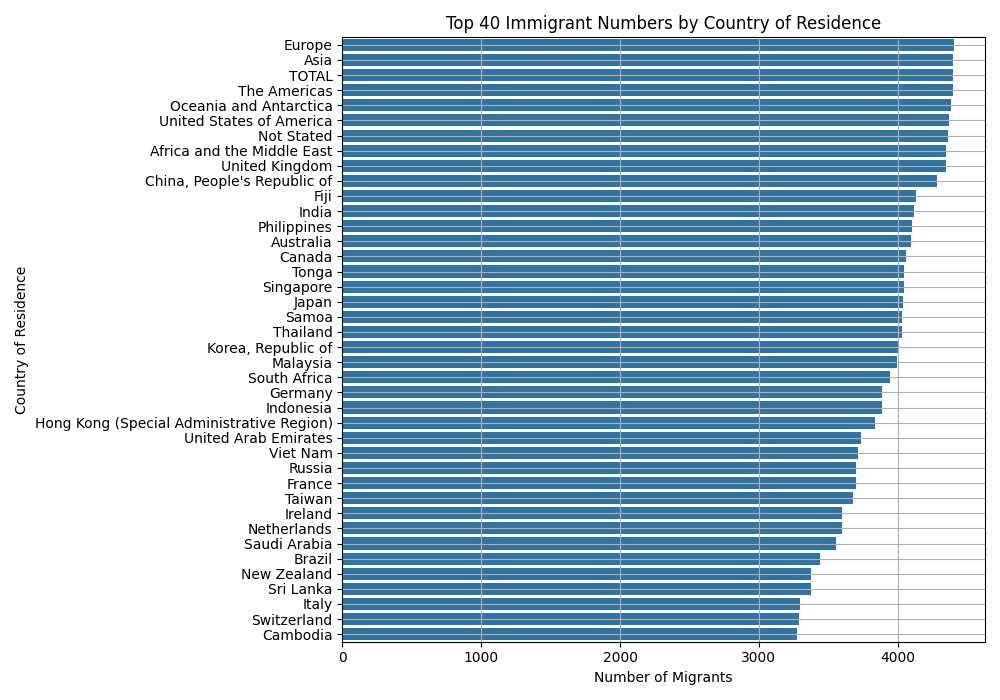
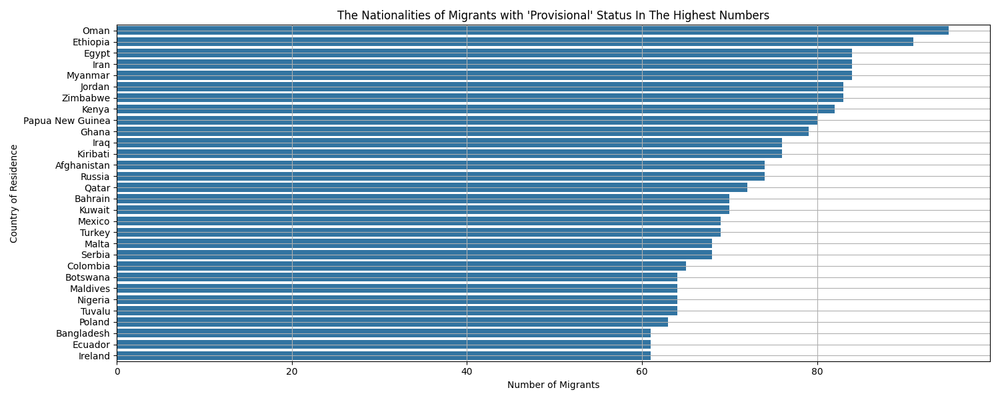
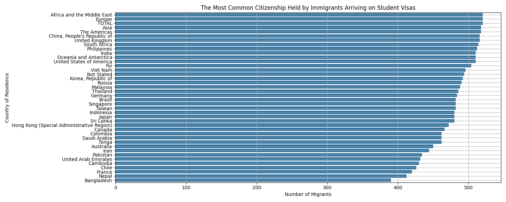

# Exploratory Analysis of New Zealand International Migration (May 2026 Release)

## Abstract

This repository contains an exploratory data analysis (EDA) of long-term international
migration arrivals to New Zealand, based on the *International Migration: May 2026*
release published by [Stats NZ](https://www.stats.govt.nz/information-releases/international-migration-may-2026/).
The analysis characterizes the composition of arriving long-term migrants by
citizenship, visa category, country of last permanent residence, provisional/final
data status, and temporal trend, using descriptive statistics and univariate/bivariate
visualizations. No supervised or unsupervised machine learning was applied; the
rationale for this decision is discussed in the [Methodology](#methodology) section.

## Data Source

- **Publisher:** Stats NZ (Statistics New Zealand)
- **Release:** International Migration: May 2026
- **Release page:** <https://www.stats.govt.nz/information-releases/international-migration-may-2026/>
- **File used:** `international-migration-may-2026-citizenship-by-visa-by-country-of-last-permanent-residence.csv`
- **Licence:** Stats NZ data is published under a
  [Creative Commons Attribution 4.0 International licence](https://creativecommons.org/licenses/by/4.0/).
  This repository redistributes the raw CSV under the same terms; see [Data Licence](#data-licence--attribution) below.

### Raw Dataset Description

| Property | Value |
|---|---|
| Rows | 366,535 |
| Columns | 10 |
| Time coverage (`year_month`) | 2001-01 to 2026-05 |
| Missing values | 0 (across all columns) |
| Duplicate rows | 0 |
| Passenger type | `Long-term migrant` (single value, non-informative) |
| Direction | `Arrivals` (single value, non-informative) |

**Columns:**

| Column | Type | Description |
|---|---|---|
| `year_month` | string (YYYY-MM) | Month of arrival |
| `month_of_release` | string (YYYY-MM) | Month the estimate was published |
| `passenger_type` | categorical | Constant: `Long-term migrant` |
| `direction` | categorical | Constant: `Arrivals` |
| `citizenship` | categorical | `NZ`, `non-NZ`, or `TOTAL` |
| `visa` | categorical | Visa category held (`Work`, `Student`, `Resident`, `Visitor`, `Other`, `NZ and Australian citizens`, `TOTAL`) |
| `country_of_residence` | categorical (249 levels) | Country/region of last permanent residence, including aggregate rows (e.g. `Asia`, `Europe`, `TOTAL`) |
| `estimate` | integer | Estimated number of migrants for the given month/category combination |
| `standard_error` | integer | Standard error of the estimate |
| `status` | categorical | `Final` (341,126 rows) or `Provisional` (25,409 rows) |

## Data Cleaning

The following preprocessing steps were applied (see `immigration.py`, function `clean_data`):

1. Rows with `standard_error != 0` were removed to retain only point estimates without
   reported sampling uncertainty (352,353 of 366,535 rows, ≈96.1%, had `standard_error == 0`).
2. The non-informative constant columns `passenger_type` and `direction`, along with
   `month_of_release` and the now-redundant `standard_error`, were dropped.
3. Rows with `estimate == 0` were removed, as they do not contribute to distributional
   analysis and were assumed to reflect structural zeros rather than measured absences.

After cleaning, the working dataset contains **348,142 rows across 6 columns**.
The `estimate` column in the cleaned dataset has a mean of 98.7, a median of 5,
a standard deviation of 530.8, and a maximum of 24,929 — indicating a strongly
right-skewed distribution dominated by a small number of high-volume category
combinations (notably `TOTAL` aggregation rows and large source countries).

## Methodology

The analysis is descriptive rather than predictive. For each categorical field of
interest (`citizenship`, `visa`, `country_of_residence`, `status`), the pipeline
computes frequency counts via `pandas.Series.value_counts()` and renders them as bar
charts using `seaborn`/`matplotlib`. A time-series view aggregates record frequency
by `year_month` over the most recent 60 months. Two filtered breakdowns are computed
by conditioning on `status == "Provisional"` and `visa == "Student"` respectively, each
cross-tabulated against `country_of_residence`.

**Important interpretive note:** because the source file is itself a table of
pre-aggregated *estimates* (one row per month × citizenship × visa × country
combination), the frequency counts produced by `value_counts()` on `country_of_residence`
or `visa` represent the **number of reporting-period records** available for that
category (i.e. how many months/combinations were published), not the **sum of migrant
estimates** for that category. This distinction is preserved throughout the analysis
and should be kept in mind when interpreting the bar charts in `plot_of_analysis/`.

### Why no machine learning was applied

The dataset was evaluated for suitability for machine learning and judged not to be a
good fit, for the following reasons:

- **No natural prediction target.** The table is a statistical aggregate (counts and
  standard errors per category-month), not a set of observations with an outcome
  variable suitable for classification or regression.
- **Structural aggregation.** A large share of rows are themselves aggregates
  (`citizenship == "TOTAL"`, `country_of_residence == "TOTAL"`, regional groupings such
  as `Asia` or `Europe`), which would leak information into any model trained on
  disaggregated rows and violates the independence assumptions of most learning
  algorithms.
- **Low cardinality of the temporal signal.** With one row per category combination
  per month, the effective number of independent time points (301 months) is small
  relative to the number of category combinations, making robust time-series modeling
  (e.g. forecasting) unreliable without substantial additional feature engineering
  that was out of scope for this exploratory pass.

Given these constraints, the analysis was scoped to descriptive statistics and
visualization, which is judged more appropriate for the structure and intended use
(official statistics reporting) of this dataset.

## Repository Structure

```
.
├── dataset/
│   └── international-migration-may-2026-citizenship-by-visa-by-country-of-last-permanent-residence.csv
├── plot_of_analysis/
│   ├── analysis_citizenship.png
│   ├── analysis_visa.png
│   ├── analysis_country_of_residence_top40.png
│   ├── analysis_estimate_max30.png
│   ├── analysis_status.png
│   ├── analysis_time.png
│   ├── Migrants_with_Provisional_Status_In_The_Highest_Numbers.png
│   ├── The_Citizenship_Most_Frequently_Held_by_Immigrants_With_Dual_Citizenship.png
│   └── The_Most_Common_Citizenship_Held_by_Immigrants_Arriving_on_Student_Visas.png
├── immigration.py
├── README.md
└── LICENSE
```

## Key Results

- **Citizenship composition:** of the 348,142 cleaned records, 159,899 (45.9%) are
  `TOTAL` (combined) rows, 139,981 (40.2%) correspond to `non-NZ` citizens, and 48,262
  (13.9%) correspond to `NZ` citizens.
- **Visa composition:** excluding the `TOTAL` category (99,886 records), the largest
  visa-category record groups are `NZ and Australian citizens` (56,104), `Visitor`
  (50,754), `Work` (44,510), `Student` (36,776), `Resident` (35,520), and `Other`
  (24,592).
- **Data status:** 341,126 records (98.0%) are marked `Final`; 25,409 (7.0% of the
  raw file, filtered down in the cleaned set) are `Provisional`, reflecting Stats NZ's
  practice of revising the most recent months' estimates as more administrative data
  becomes available.
- **Country of residence coverage:** the dataset covers 249 distinct
  `country_of_residence` values, including individual countries and Stats NZ's own
  regional aggregates (`Asia`, `Europe`, `The Americas`, `Oceania and Antarctica`,
  `Africa and the Middle East`, `Not Stated`, `TOTAL`).
- **Provisional-status geography:** among records flagged `Provisional`, the countries
  of last permanent residence with the most such records are Oman, Ethiopia, Egypt,
  Iran, Myanmar, Jordan, Zimbabwe, Kenya, Papua New Guinea, and Ghana — consistent with
  longer administrative confirmation times for long-term migration from these
  countries of residence.
- **Student-visa geography:** after `TOTAL`/regional aggregates, the countries of
  residence with the most published student-visa records are China, the United
  Kingdom, South Africa, the Philippines, and India.
- **Temporal range:** the underlying series spans January 2001 to May 2026 (301
  months), with the time-series plot (`analysis_time.png`) restricted to the most
  recent 60 months for readability.

Full visual outputs are provided in `plot_of_analysis/` and are regenerated by running
`immigration.py`.

## Key Visualizations

### Citizenship composition



Record counts by `citizenship`. The `TOTAL` category (combined NZ + non-NZ citizens)
accounts for the largest share of published records (159,899; 45.9%), followed by
`non-NZ` (139,981; 40.2%) and `NZ` (48,262; 13.9%).

### Visa category composition



Excluding the `TOTAL` aggregate, `NZ and Australian citizens` (56,104 records) and
`Visitor` (50,754) are the largest visa-category groups, ahead of `Work` (44,510),
`Student` (36,776), `Resident` (35,520), and `Other` (24,592).

### Long-term migration trend, last 60 months



Monthly record counts for the most recent 60 months of the series (up to 2026-05),
illustrating the reporting pattern around the post-pandemic recovery period and the
gradual transition of recent months from `Provisional` to `Final` status.

### Top 40 countries of last permanent residence



Ranking of the 40 most frequently published `country_of_residence` values. Stats NZ's
own regional aggregates (`Europe`, `Asia`, `The Americas`, `TOTAL`) sit at the top
because they are reported every month regardless of migrant volume; individual
countries such as the United Kingdom and China follow closely, reflecting their long
and consistently reported migration history with New Zealand.

### Countries with the most provisional-status records



Countries of residence most frequently associated with `Provisional` (not yet
finalized) records — led by Oman, Ethiopia, Egypt, Iran, and Myanmar — consistent with
longer administrative confirmation times for long-term migration originating from
these countries.

### Countries of residence for student-visa arrivals



Among records filtered to `visa == "Student"`, China, the United Kingdom, South
Africa, the Philippines, and India are the most frequently reported countries of last
permanent residence, after the `TOTAL`/regional aggregate rows.

The remaining figures (`analysis_estimate_max30.png`,
`analysis_status.png`,
`The_Citizenship_Most_Frequently_Held_by_Immigrants_With_Dual_Citizenship.png`) are
available in `plot_of_analysis/` and follow the same methodology.

## Reproducing the Analysis

**Requirements:** Python ≥ 3.9, `pandas`, `matplotlib`, `seaborn`.

```bash
pip install pandas matplotlib seaborn
python immigration.py
```

The script loads the CSV, prints an inspection summary (`head`, `tail`, `describe`,
`info`, null/duplicate checks, and value counts) to standard output, applies the
cleaning steps described above, and writes all figures to `plot_of_analysis/`.

## Limitations

- The analysis relies on `value_counts()` over category labels rather than summed
  `estimate` values; consequently, the bar charts describe *how many published
  records exist* per category, not the *total number of migrants* per category. A
  natural extension is to re-run the same breakdowns using `groupby(...)["estimate"].sum()`.
- Rows with non-zero `standard_error` (3.9% of the raw file) were excluded rather than
  weighted, which slightly biases the cleaned sample toward more precisely estimated
  (typically larger) category combinations.
- Regional aggregate rows (e.g. `Asia`, `TOTAL`) were not separated from individual
  countries prior to ranking, so top-N country charts should be read alongside the
  column definitions above.

## Data Licence & Attribution

The raw dataset in `dataset/` is © Stats NZ and is reproduced under the
[Creative Commons Attribution 4.0 International licence](https://creativecommons.org/licenses/by/4.0/).
When reusing the data, please attribute Stats NZ and link to the original release:
<https://www.stats.govt.nz/information-releases/international-migration-may-2026/>.

The analysis code (`immigration.py`) and this README are licensed under the MIT
License; see [`LICENSE`](LICENSE).
